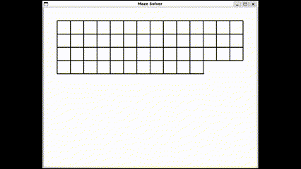

# Project Title: Maze Generator and Solver

## Overview

This is my ground-up implementation of a maze generator and solver, inspired by the Boot.dev version. The program generates and solves a random maze using two depth-first algorithms. I built this project to dive deeper into algorithmic problem-solving. The project uses Tkinter for graphics.



## Features

- **Maze Generation**: Uses a depth-first search algorithm to create a random maze.
- **Maze Solving**: Solves the generated maze using another depth-first search algorithm.
- **Graphical Interface**: Visual representation of the maze and the solution using Tkinter.

## Tech Stack

- **Language**: Python
- **Libraries**: Tkinter (for graphics)

## Usage

```bash
./scripts/run.sh
```

To run included unit tests:

```bash
./scripts/test.sh
```

## License

This project is open source under the [MIT License](LICENSE).

## Acknowledgments

A big thank you to Boot.dev for the guidance and inspiration throughout this project.
